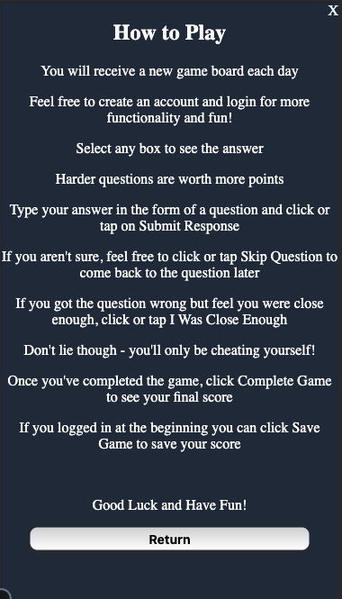

# Wutz!

Wutz is a daily social trivia game using an API scrapping Jeopardy Productions trivia. [^1]

## Table of Contents

- [🔗 Important Links](#🔗-important-links)
- [🧑‍💻 Developed Using](#🧑‍💻-developed-using)
- [🎮 Gameplay](#🎮-gameplay)
- [📱 Wutz Interface](#📱-wutz-interface)
- [🚀 Getting Started](#🚀-getting-started)
- [👤 Authors](#-authors)

## 🔗 Important Links

### Front End

[Depolyed Game: Play Wutz!](https://hidden-spire-29708-f563a2b7cacc.herokuapp.com/)

[Github](https://github.com/wutz-game/wutz_fe)

### Back End

[Deployed API](https://pacific-wildwood-99462-95c6d81ab3e1.herokuapp.com/api/challenges)

[GitHub Repo](https://github.com/wutz-game/wutz_be)

## 🧑‍💻 Developed Using

* Rails 7.0.X
* Javascript
* HTML
* CSS
* API https://jservice.io/

## 🎮 Gameplay

Three categories are randomly chosen and will have 3 questions from said categories that increase in difficulty.
Questions are given a point value (1, 2, 3) based on the difficulty of the question. Players do not see the questions but can see the point value.
Once a tile is selected the player is presented with a question which they can then make a guess and submit their answer, or can skip the question.
For each question correct the player gains a number a points equal to the quesitons difficulty while getting the question wrong subtracts points.
The game is played to see how many points you can get after all questions are attempted.

## 📱 Wutz Interface


Players start at the Main Menu where they can Login, Play the Game (with or without logging in).




Players are presented with a fresh gameboard each day.


Players then can select a tile to recieve a question and submit an answer.


If the answer is wrong, the user can choose to either Return to Game Board or click "I Was Close Enough" which will award them the point.


The board squares will change color based on the outcome of each question.

* Blue means the question hasn't been answered or skipped yet.
* Green means the question was answered correctly or an incorrect answer was overridden.
* Red means the qestion was answered incorrectly and the answer was not overridden.
* Yellow means the question was skipped and the user can return to this question to answer it later if they choose.


When the user has finished, they click Complete Game to be taken to the results page.

This step actually converts localStorage() from Javascript into a cookie to be used by Rails.


Clicking Save Game makes the API call to the Back End to record the game results.


## 🚀 Getting Started

### Requirements

- Rails 7.0.X
- Ruby 3.2.x
- PostgresQL

### Installing

<details closed>

<summary>Clone the repo to your local machine</summary>

```
You can also fork it if you would like to work on your own project.
```

</details>

<details closed>

<summary>Install all requisite Gems:</summary>

```
bundle install
```

</details>

<details closed>

<summary>Create and seed your local Postgres database</summary>

```
rails db:{create,migrate,seed}
```

</details>

### Testing

<details closed>

<summary>Code testing is done with these gems and bundle exec rspec</summary>

```
  gem "rspec-rails"
  gem "capybara"
  gem "simplecov"
  gem "selenium-webdriver"
  gem "webdrivers"
  gem "vcr"
  gem "webmock"
  gem "launchy"
```

</details>


## 👤 Authors

**Wutz** is a student project built in September, 2023 for the Backend Program of the [Turing School of Software and Design](https://turing.edu/).

- **Ethan Black** ❗([Github](https://github.com/ethanrossblack), [LinkedIn](https://www.linkedin.com/in/ethanrossblack/))
- **Chris Cullinane** ❗ ([Github](https://github.com/topher-nullset), [LinkedIn](https://www.linkedin.com/in/chris-cullinane-be/))
- **Ian Lyell** ❗ ([Github](https://github.com/ILyell), [LinkedIn](https://www.linkedin.com/in/ian-lyell/))
- **Connor Richmond** ❗ ([Github](https://github.com/ConnorRichmond), [LinkedIn](https://www.linkedin.com/in/corichmond/))
- **Mike Wood** ❗ ([Github](https://github.com/MWoodshop), [LinkedIn](https://www.linkedin.com/in/michaelwilliamwood/))

## Notice

All clues are pulled from [jService.io](https://jservice.io/).


[^1]: _The Jeopardy! game show and all elements thereof, including but not limited to copyright and trademark thereto, are the property of Jeopardy Productions, Inc. This application is not affiliated with, sponsored by, or operated by Jeopardy Productions, Inc._

